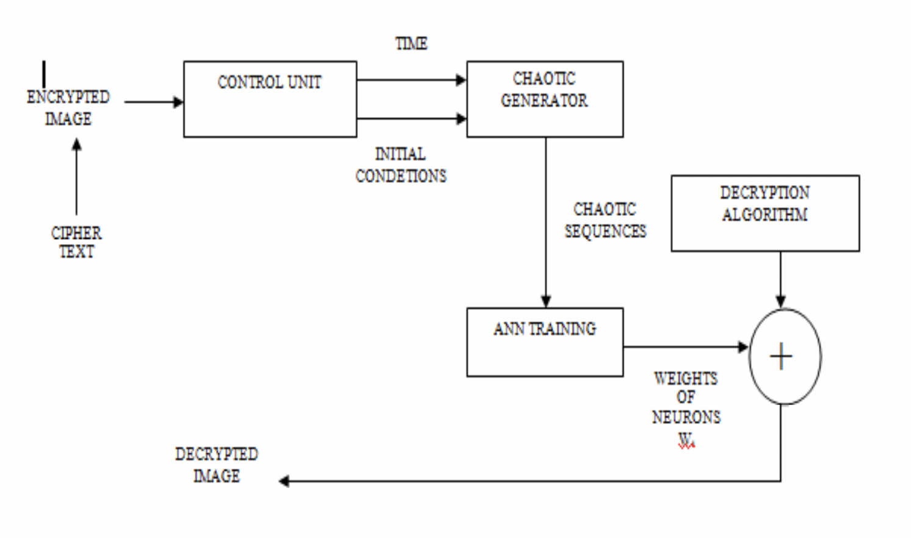

# Image-Encryption-and-Decryption
The project elaborating Artificial Neural Network, its various characteristics and business applications. A Neural Network is a machine which is designed to work like the brain. It has the ability to perform complex calculations with ease. Cryptography is the exchange of information among the users without leakage of information to others. Many public key cryptography are available which are based on number theory but it has the drawback of requirement of large computational power, complexity and time consumption during generation of key. To overcome these drawbacks, we analyzed neural networks as the best way to generate secret keys. In this paper we proposed a very new approach in the field of cryptography. We are using two artificial, neural networks in the field of cryptography. First One is an ANN based n-state sequential machine and Other One is a chaotic neural network. In our project, we have learned different neural network architectures as well as training algorithms. Sequential machine is successfully implemented using a Jordan network, trained with a back-propagation algorithm. This sequential machine was used for encryption with the starting key as the key for the decryption process. Chaotic neural networks are also used for Cryptography.

The system uses an encryption method based on CNN and AES algorithm to increase the security of images from unauthorized access. In the proposed system two approaches chaotic cryptosystems and ANN based cryptosystems are combined to make chaotic based ANN systems. The encryption phase consists of a control unit, chaotic generator, ANN training and encryption algorithm. The decryption phase consists of a control unit, chaotic generator, ANN training and decryption algorithm.

    

#### AES algorithm
It is of three types: AES-128, AES-192 and AES256. This classification is done based on the key used in the algorithm for encryption and decryption process. The numbers denote the size of the key in bits. This key size determines the security level as the size of key increases the level of security increases. The AES algorithm uses a round function. That is composed of four different byte oriented transformations: Substitution byte, Shift row, Mix columns, Add round key.

    

Artificial Neural Networks is a powerful technique that has the ability to emulate highly complex computational machines. We have used this technique to build simple sequential machines and combinational logic using backpropagation algorithms. Artificial Neural Networks can be used to implement many complex combinational as well as sequential circuits. The use of ANN in the field of Cryptography is investigated using two methods. A sequential machine based method for encryption of data is designed. Also, a chaotic neural network for digital signal cryptography is analyzed. Better results can be achieved by improvement of code or by use of better training algorithms. Thus, ANN can be used as a new method of encryption and decryption of data.
